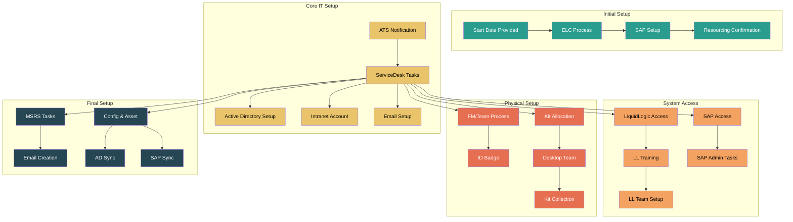
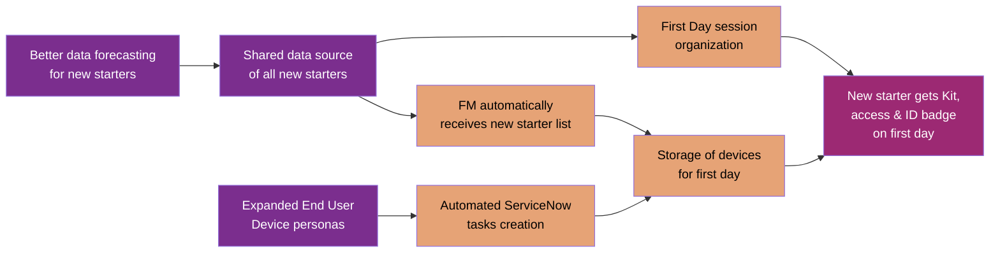

# Joiners Process Transformation: As-Is Analysis & Development Rationale

## Current Joiners Process (As-Is)

The current joiners process involves multiple stakeholders, systems, and manual handoffs, creating a complex web of interactions that can lead to inefficiencies and potential delays in onboarding new employees. Based on the detailed workflow diagrams, the process includes numerous sequential steps across different teams and systems.

### Detailed Process Flow

### Key Systems and Handoffs

The current process involves several key systems and handoffs:

1. **ELC (Executive Leadership Committee)** - Responsible for adding new starters to SAP and confirming personnel numbers
2. **ATS (Applicant Tracking System)** - Triggers notifications when a new joiner is confirmed
3. **ServiceDesk** - Creates accounts, manages security groups, and coordinates various IT provisioning tasks
4. **LiquidLogic** - Handles training and system access for specific applications
5. **SAP Security Admin** - Creates user portal access and links personnel accounts to SAP records
6. **Strategy & Planning Team** - Approves requests and ensures employees are properly set up in ServiceNow
7. **Desktop Team** - Manages hardware kit allocation, checking stock and updating asset records
8. **MSRS (Microsoft Reporting Services)** - Checks for duplicate employee names and creates email addresses
9. **Config & Asset Team** - Performs daily checks and verifies unique GUIDs

### Key Pain Points in Current Process:

1. **Multiple Manual Handoffs**: The process requires numerous manual communications between departments (at least 20+ handoffs visible in the workflow), creating potential bottlenecks and delays.

2. **Form Redundancy**: Multiple forms and requests are generated across different systems (ServiceNow, SAP, LiquidLogic, etc.).

3. **Disconnected Systems**: Information exists in silos across email, ServiceNow, SAP, LiquidLogic, and Active Directory without a centralized data source.

4. **Lack of Automation**: Most processes require manual intervention, including:
   - Manual verification of employee information
   - Manual creation of accounts across multiple systems
   - Manual checks for kit availability
   - Manual email communications between teams

5. **Inconsistent First Day Experience**: The complex process may result in new joiners not having all necessary equipment and access on day one, as evidenced by:
   - Separate processes for kit allocation
   - Manual email to collect kit
   - Multiple system access provisioning steps that may not complete in time

6. **Resource Intensive**: The process demands significant time from multiple teams:
   - ELC team for SAP setup
   - ServiceDesk for account creation
   - LiquidLogic team for training coordination
   - Strategy & Planning team for approvals
   - Desktop team for kit allocation
   - MSRS team for email setup
   - Config & Asset team for verification

7. **Limited Visibility**: No shared data source for upcoming new starters makes resource planning difficult, with information scattered across:
   - ATS system
   - SAP
   - ServiceNow
   - Email communications
   - Multiple overnight batch processes

8. **Timing Dependencies**: The process relies on overnight batch processes and manual checks that can introduce delays:
   - AD overnight run update file
   - SAP overnight run upload file
   - Manual verification of GUIDs and employee records

9. **Complex Kit Provisioning**: Hardware allocation involves multiple steps:
   - ServiceNow task creation
   - Manual stock checks
   - Email notifications
   - Manual collection process
   - Manual record updates

## Current Process Metrics

### Key Performance Indicators
- Average onboarding completion time: [TBD] days
- Number of manual handoffs per joiner: 20+
- Resource hours spent per joiner: [TBD] hours
- Cost per joiner: [£TBD]
- Error rate: [TBD]%
- Support tickets per joiner: [TBD]
- Average time to full system access: [TBD] days

### Process Volume Metrics
- Average number of new joiners per month: [TBD]
- Peak hiring periods: [TBD]
- Current backlog of pending requests: [TBD]

## Key User Personas

### New Joiner
- **Pain Points**:
  - Uncertain about what to expect on day one
  - Multiple systems to learn simultaneously
  - Delayed access to required tools and systems
  - Inconsistent communication about process status
  - Manual collection of equipment
- **Goals**:
  - Smooth first day experience
  - Immediate access to required systems
  - Clear communication about process
  - Ready-to-use equipment on day one
  - Single point of contact for queries

### Line Manager
- **Pain Points**:
  - Multiple approval steps across different systems
  - Lack of visibility into process status
  - Time spent on administrative tasks
  - Delayed team member start
  - Inconsistent onboarding experience
- **Goals**:
  - Streamlined approval process
  - Real-time visibility into onboarding status
  - Reduced administrative burden
  - Team member ready to work on day one
  - Consistent onboarding experience

### HR Team
- **Pain Points**:
  - Complex coordination between multiple teams
  - Manual data entry across systems
  - Lack of process standardization
  - Time-consuming verification steps
  - Risk of compliance issues
- **Goals**:
  - Automated coordination
  - Single source of truth
  - Standardized processes
  - Reduced manual intervention
  - Improved compliance tracking

### IT Support Team
- **Pain Points**:
  - Multiple system access requests
  - Manual security group configuration
  - Reactive support model
  - High volume of support tickets
  - Complex kit allocation process
- **Goals**:
  - Automated access provisioning
  - Standardized security profiles
  - Proactive support model
  - Reduced ticket volume
  - Streamlined kit allocation

## Success Criteria

### Process Efficiency
- Reduce onboarding time from [TBD] to 1 day
- Eliminate 20+ manual handoffs to 0
- Reduce resource hours per joiner by [TBD]%
- 100% automated task creation
- Zero overnight batch dependencies

### User Experience
- 100% of new joiners receive complete kit on day one
- 100% system access granted by end of day one
- Reduce support tickets by [TBD]%
- Zero manual collection of equipment
- Single point of contact for all queries

### System Integration
- Single source of truth for all joiner data
- Real-time synchronization across all systems
- Zero manual data entry
- Automated compliance checks
- Standardized security profiles

### Cost Reduction
- Reduce cost per joiner by [TBD]%
- Reduce IT support time by [TBD] hours per joiner
- Eliminate manual verification costs
- Reduce system maintenance costs
- Optimize resource allocation

## Business Value

### Financial Impact
- Annual cost savings: [£TBD]
- Reduced IT support costs: [£TBD]
- Improved productivity: [£TBD]
- Reduced compliance risk: [£TBD]
- Optimized resource utilization: [£TBD]

### Operational Benefits
- Reduced risk of security incidents
- Improved compliance tracking
- Better resource utilization
- Standardized processes
- Real-time reporting capabilities

### Employee Experience
- Improved employee satisfaction
- Reduced time to productivity
- Better retention rates
- Enhanced employer brand
- Improved team integration

## Information Gathering Checklist

### Process Metrics
- [ ] What is the current average time to complete onboarding?
- [ ] How many support tickets are generated per joiner?
- [ ] What is the current error rate in the process?
- [ ] How many resource hours are spent per joiner?
- [ ] What is the current cost per joiner?
- [ ] What are the peak hiring periods?
- [ ] What is the average number of new joiners per month?

### User Experience
- [ ] What are the most common complaints from new joiners?
- [ ] What feedback do line managers provide about the process?
- [ ] What are the main pain points for HR team members?
- [ ] What challenges do IT support staff face?
- [ ] How do different departments rate the current process?

### System Integration
- [ ] What is the current data accuracy rate across systems?
- [ ] How often do synchronization issues occur?
- [ ] What is the cost of maintaining multiple systems?
- [ ] What are the current system limitations?
- [ ] What integration capabilities exist?

### Compliance and Risk
- [ ] What are the current compliance requirements?
- [ ] What security risks exist in the current process?
- [ ] What audit requirements need to be met?
- [ ] What data protection regulations apply?
- [ ] What are the current risk mitigation measures?

### Resource Utilization
- [ ] How many FTE are dedicated to the process?
- [ ] What is the current workload distribution?
- [ ] What are the peak resource requirements?
- [ ] What skills are required for the process?
- [ ] What training is currently needed?

### Cost Analysis
- [ ] What are the current system maintenance costs?
- [ ] What is the cost of manual interventions?
- [ ] What are the support costs per joiner?
- [ ] What are the training costs?
- [ ] What are the compliance-related costs?

## Proposed Changes (In Development)

The organization is developing a streamlined, more automated joiners process to address these pain points.

### Key Improvements & Rationale:

1. **Centralized Data Source**
   - **Problem Addressed**: Information silos across ATS, SAP, ServiceNow, and email communications
   - **Solution**: Shared data source of all upcoming new starters
   - **Benefit**: Eliminates the need for multiple email communications and provides a single source of truth

2. **Automated Workflows**
   - **Problem Addressed**: The 20+ manual handoffs between teams and overnight batch processes
   - **Solution**: Automation to create ServiceNow tasks based on standardized profiles
   - **Benefit**: Reduces delays from manual interventions and eliminates dependency on overnight batch processes

3. **Standardized End User Device Personas**
   - **Problem Addressed**: Complex, manual security group assignments and software access provisioning
   - **Solution**: Predefined EUD personas with standard software access requirements
   - **Benefit**: Eliminates the need for ServiceDesk to manually configure security groups for each employee

4. **Streamlined Facilities Management**
   - **Problem Addressed**: Manual ID verification process and CPAD form requirements
   - **Solution**: Automatic notification to FM with list of new starters
   - **Benefit**: Removes the need for FM/Team to email ELC for verification and eliminates the Gentech system step

5. **Enhanced First Day Experience**
   - **Problem Addressed**: Current process where employees must collect kit themselves after receiving email
   - **Solution**: Organized welcome session with all equipment and access ready
   - **Benefit**: Ensures all systems access and equipment are ready on day one, eliminating the disjointed experience

6. **Reduced Manager Workload**
   - **Problem Addressed**: Multiple email confirmations and approvals required from managers
   - **Solution**: No additional forms needed after recruiting
   - **Benefit**: Eliminates the need for managers to respond to Resourcing emails and approve ServiceNow requests

7. **Proactive Resource Planning**
   - **Problem Addressed**: Reactive kit allocation process with manual stock checks
   - **Solution**: Better data forecasting integrated with vacancy approval process
   - **Benefit**: Ensures hardware is pre-allocated and ready, eliminating the manual Desktop team stock checks

8. **Simplified System Access**
   - **Problem Addressed**: Multiple separate system access requests (AD, SAP, LiquidLogic)
   - **Solution**: Automated provisioning based on employee type
   - **Benefit**: Eliminates the need for separate access requests and manual account creation across systems

9. **Elimination of Duplicate Checks**
   - **Problem Addressed**: Multiple verification steps by different teams (MSRS, Config & Asset)
   - **Solution**: Single validation at data source
   - **Benefit**: Removes redundant checks for duplicate names and GUID verification

## Conclusion

The transformation from the current complex, manual joiners process to the streamlined, automated approach represents a significant improvement in several key areas:

1. **Process Efficiency**: Reducing the 20+ manual handoffs to a streamlined, automated flow will dramatically decrease the time from joiner confirmation to full onboarding completion.

2. **Resource Optimization**: By eliminating redundant checks and manual interventions from multiple teams (ELC, ServiceDesk, LiquidLogic, Strategy & Planning, Desktop, MSRS, Config & Asset), valuable IT and HR resources can be redirected to more strategic activities.

3. **System Integration**: Replacing the disconnected systems (ATS, SAP, ServiceNow, LiquidLogic, AD, Gentech) with a centralized data source eliminates information silos and reduces synchronization errors.

4. **Employee Experience**: The new process ensures that joiners receive a consistent, professional first-day experience with all necessary equipment and access ready, rather than the current fragmented approach where employees must collect their own kit.

5. **Risk Reduction**: Automating account provisioning and access rights based on standardized profiles reduces the risk of security misconfigurations or access control errors that can occur with manual setup.

6. **Scalability**: The automated approach can more easily handle fluctuations in hiring volume without requiring proportional increases in support staff time.

The detailed workflow analysis reveals that the current process has evolved organically over time, resulting in unnecessary complexity and redundancy. The proposed changes represent a thoughtful redesign that leverages automation and standardization to create a more efficient, reliable, and user-friendly onboarding experience that better serves both the organization and its new employees.
